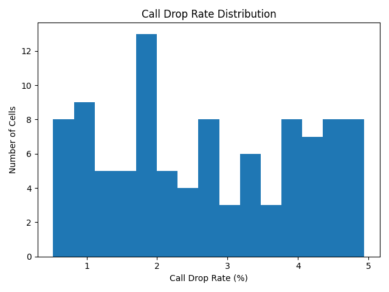
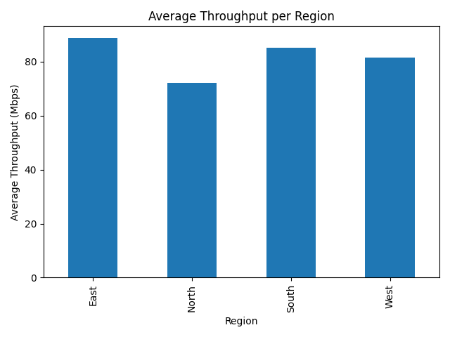

# Telecom Network KPI Analysis

## Overview
This project demonstrates a Telecom KPI analysis pipeline using Python. It simulates real-world network data, analyzes key performance indicators, and visualizes network performance across different regions.

The project showcases skills in:
- Telecom & Networking
- Data Analysis & Visualization
- Python, Pandas, Matplotlib
- Automation & Project Structuring

---

## Project Structure

```
telecom-network-kpi-analysis/
├── data/                # Synthetic data files
├── scripts/             # Python scripts
│   ├── generate_synthetic_data.py
│   └── analyze_telecom_kpis.py
├── visuals/             # Generated graphs
└── README.md            # Project explanation
```

---

## How It Works

1. **Data Generation**  
   `generate_synthetic_data.py` creates synthetic network KPI data including:
   - Cell IDs
   - Region (North, South, East, West)
   - Call Drop Rate (%)
   - Throughput (Mbps)
   - Latency (ms)

2. **Data Analysis & Visualization**  
   `analyze_telecom_kpis.py`:
   - Loads the CSV data
   - Calculates key KPIs:
     - Average Call Drop Rate
     - Average Throughput
     - Average Latency
   - Generates visualizations:
     - Call Drop Rate Distribution
     - Average Throughput per Region

---

## Example Outputs

### Call Drop Rate Distribution


### Average Throughput per Region


---

## Key Skills Demonstrated
- Data Analysis using Python & Pandas
- Data Visualization using Matplotlib
- Understanding of Telecom KPIs
- Synthetic Data Generation
- Project structuring for professional presentation

---

## Future Improvements
- Add more telecom KPIs like Jitter, Packet Loss, and Availability
- Automate monthly report generation
- Deploy pipeline on cloud (AWS/GCP/Azure)
- Add interactive visualizations using Plotly or Dash
